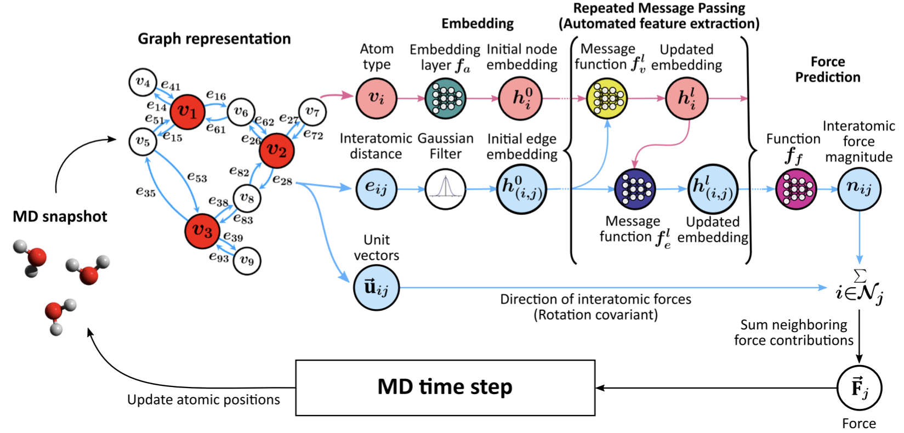

# Atomistic Force Fields based on [GNNFF](https://www.nature.com/articles/s41524-021-00543-3)

[](https://app.travis-ci.com/github/ken2403/gnnff)
[](https://github.com/python/black)



GNNFF [1] is a graph neural network framework to directly predict atomic forces from automatically extracted features of the local atomic environment that are translationally-invariant, but rotationally-covariant to the coordinate of the atoms.
This package is an atomistic force fields that constructed based on GNNFF.

**Requirements:**

- [python 3](https://www.python.org/)
- [ASE](https://wiki.fysik.dtu.dk/ase/index.html)
- [numpy](https://numpy.org/)
- [PyTorch](https://pytorch.org/) (>=1.7)
- [schnetpack](https://schnetpack.readthedocs.io/en/stable/)

***Note: We recommend using a GPU for training the neural network.***

## Installation

Install this project by `git`.

### Clone the repository

```bash
git clone https://github.com/ken2403/gnnff.git
cd gnnff
```

### Install requirements

```bash
pip install -r requirements.txt
```

### Install this package

```bash
pip install .
```

You're ready to go!

## Getting started

The example scripts provided by gnnff are inserted into your PATH during installation. These scripts are in `gnnff/src/scripts`.

### Preparing the dataset

Prepare the dataset in [ase database format](https://wiki.fysik.dtu.dk/ase/ase/db/db.html).
Or prepare a atoms `.xyz` file and convert it to ase database using the script provided by schnetpack.

```bash
spk_parse.py  /path_to_xyz  /save_path_to_db
```

### Preparing argument file

Prepare the `.json` file that defines the hyperparameters for training.
The example file can be found in `gnnff/src/scripts/argument`
If the argument `.json` file is ready, you can train the model like this way.

```bash
gnnff_run  from_json  /path_to_train.json
```

Learned model are saved as `best_model` in model direcctory.

### Evaluating learned model

The same script can also be used to evaluate the learned model.
Prepare a `.json` file for evaluation.

```bash
gnnff_run  from_json  /path_to_eval.json
```

Write a result file `evaluation.txt` into the model directory.

### Using POSCAR file as an input

You can also input one `POSCAR` structure file into the learned model to calculate total energy and interatomic forces.
This is useful for phonon calculations with [phonopy](https://phonopy.github.io/phonopy/).

```bash
gnnff_run  from_poscar  /path_to_POSCAR  /path_to_learned_model  --cutoff  cutoff_radious  [--cuda]
```

If GPU is availabel, set `--cuda`.
The calculation results are written to `gnnff_run.xml` file and saved in the same directory as the `POSCAR`.

## References

- [1] C. W. Park, M. Kornbluth, J. Vandermause, C. Wolverton, B. Kozinsky, J. P. Mailoa, *Accurate and scalable graph neural network force field and molecular dynamics with direct force architecture.* npj Computational Materials. **7**, 1–9 (2021). [link](https://www.nature.com/articles/s41524-021-00543-3)

- [2] T. Xie, J. C. Grossman, *Crystal Graph Convolutional Neural Networks for an Accurate and Interpretable Prediction of Material Properties.* Phys. Rev. Lett. **120**, 145301 (2018). [link](https://journals.aps.org/prl/abstract/10.1103/PhysRevLett.120.145301)

- [3] [implementaion of Crystal Graph Convolutional Neural Networks](https://github.com/txie-93/cgcnn)
